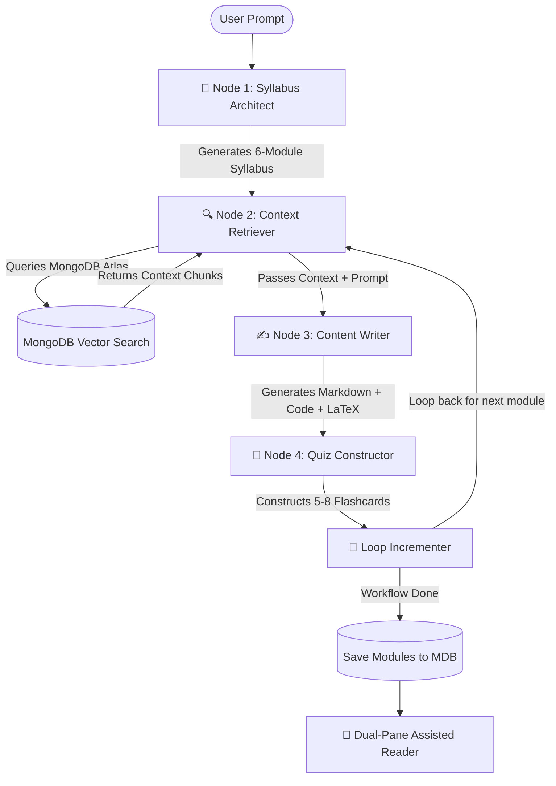

# 🎓 zLearner_ – AI Course Generator & Assisted Reader

```text
███████╗██╗     ███████╗ █████╗ ██████╗ ███╗   ██╗███████╗██████╗       
╚══███╔╝██║     ██╔════╝██╔══██╗██╔══██╗████╗  ██║██╔════╝██╔══██╗      
  ███╔╝ ██║     █████╗  ███████║██████╔╝██╔██╗ ██║█████╗  ██████╔╝      
 ███╔╝  ██║     ██╔══╝  ██╔══██║██╔══██╗██║╚██╗██║██╔══╝  ██╔══██╗      
███████╗███████╗███████╗██║  ██║██║  ██║██║ ╚████║███████╗██║  ██║██████╗
╚══════╝╚═══════╝╚═══════╝╚═╝  ╚═╝╚═╝  ╚═╝╚═╝  ╚═══╝╚═══════╝╚═╝  ╚═╝╚═════╝
```

**zLearner_** is an advanced AI-powered learning platform designed to act as your "Second Brain". Featuring a retro-modern minimalist user interface, it enables you to generate structured courses on any topic, read them using an interactive assisted reader, review generated recall flashcards, and test yourself with dynamically generated quizzes.

Under the hood, course generation is governed by a robust multi-node state machine built with **LangGraph** and **Groq**, enabling contextual curriculum planning, semantic document retrieval, high-quality content drafting, and assessment construction.

---

## ✨ Core Features

### 1. 🤖 LangGraph-Driven Multi-Node Course Generator
Instead of generating generic linear summaries, **zLearner_** employs a **4-node LangGraph state machine** to structure, enrich, draft, and validate full 6-module courses in a logical progression loop:
*   **📐 Syllabus Architect**: Accepts a user's prompt and target audience to generate a structured 6-module course skeleton using Groq structured outputs.
*   **🔍 Context Retriever**: Queries your local database using **MongoDB Atlas Vector Search** to find semantic matches from pre-ingested reference materials.
*   **✍️ Content Writer**: Crafts comprehensive Markdown modules, enriching text with real-world analogies, code snippets, and mathematical formulas.
*   **🧠 Quiz Constructor**: Automatically reviews the generated module text and creates 5–8 active-recall flashcard questions.
*   *Supports both complete 6-module syllabus generation and dynamic individual topic additions to existing courses.*

### 2. 📖 Interactive Assisted Reader
A dual-pane environment tailored for distraction-free learning and reinforcement:
*   **Rich Markdown Rendering**: Renders headers, lists, code syntax blocks, and complex mathematical formulas (inline and block equations) using **KaTeX**.
*   **📝 Live Markdown Editing**: Make inline edits directly to any topic's source content to correct mistakes, add personal notes, or refine explanations.
*   **💬 RAG-powered AI Tutor Chat**: Ask questions directly in the reader. The AI assistant uses vector retrieval to search course contents and background knowledge, giving you highly contextual responses.
*   **🎴 Active Recall Flashcards**: Interactive digital cards with standard flip animations to test key terms and definitions.
*   **✍️ Graded Quizzes**: Dynamic multiple-choice questions generated on the spot. Submit your answers for real-time grading, scoring, and feedback.

### 3. 📂 Local Knowledge Reference Ingest Pipeline
Provide custom source textbooks, PDFs, lecture transcripts, or notes to ground the generation engine:
*   Includes a command-line ingestion tool (`scripts/ingestReferences.mjs`) to read and chunk document files.
*   Generates **384-dimensional dense vector embeddings** locally via `@huggingface/transformers` using the `Xenova/all-MiniLM-L6-v2` model.
*   Saves vectors and raw text chunks into a MongoDB Atlas collection, ready for semantic matching during syllabus synthesis.

### 4. 🎨 Premium Retro-Modern User Interface
*   Built with a high-contrast terminal-like grid background.
*   Optimized with retro typography (`Departure Mono` & `Roboto`).
*   Smooth animations, responsive panels, and reactive dashboard layouts designed to feel premium.

---

## 🛠️ Technology Stack

| Layer | Technology Used |
| :--- | :--- |
| **Framework & Engine** | Next.js 16 (App Router), React 19, Node.js runtime |
| **State Orchestration** | LangGraph JS (`@langchain/langgraph`) |
| **LLM Inference** | ChatGroq (`@langchain/groq`) via Llama-3.3-70b-versatile |
| **Database** | MongoDB Atlas with Mongoose ORM |
| **Vector Engine** | MongoDB Atlas Vector Search |
| **Embeddings** | `@huggingface/transformers` (local running model `Xenova/all-MiniLM-L6-v2` for scripts) & HF Cloud Inference API (for server routes) |
| **Auth** | NextAuth.js (v5 Beta) + `bcryptjs` |
| **Styling** | Tailwind CSS v4, custom CSS variables |
| **Math & Rendering** | KaTeX (`katex`), React Markdown |
| **Validation** | Zod |

---

## ⚙️ Setup & Installation Instructions

Follow these steps to set up **zLearner_** locally on your machine:

### Prerequisites
*   [Node.js](https://nodejs.org/) (v18.x or above recommended)
*   A running [MongoDB Atlas](https://www.mongodb.com/cloud/atlas) database cluster (or local MongoDB database supporting vector search index capability)

---

### Step 1: Clone the Repository
```bash
git clone https://github.com/your-username/zlearner.git
cd zlearner
```

### Step 2: Install Dependencies
```bash
npm install
```

### Step 3: Configure Environment Variables
Create a file named `.env.local` in the root directory and define the following variables. 

> [!WARNING]
> Keep your real API keys confidential. Do not commit `.env.local` to public repositories.

```env
# NextAuth Configuration
AUTH_SECRET="dummy_next_auth_secret_minimum_32_characters_long"
NEXTAUTH_SECRET="dummy_next_auth_secret_minimum_32_characters_long"
NEXTAUTH_URL="http://localhost:3000"

# MongoDB Database Connection
# Replace with your actual Atlas connection string if you wish to run the app
MONGODB_URI="mongodb+srv://<username>:<password>@<cluster-url>.mongodb.net/zLearner?retryWrites=true&w=majority"

# LLM Providers & Embeddings API
# Get a free key at console.groq.com
GROQ_API_KEY="gsk_dummyGroqApiKey1234567890abcdefghijklmnopqrstuv"

# Hugging Face User Access Token (needed for the real-time cloud embeddings api)
HF_TOKEN="hf_dummyHuggingFaceToken1234567890abcdef"
```

---

### Step 4: Configure MongoDB Atlas Vector Search
To enable context retrieval in the LangGraph workflow, you must set up a Vector Search index on your cluster:

1. Log in to your **MongoDB Atlas Dashboard**.
2. Navigate to your database and select **Search Indexes** under your collection view.
3. Click **Create Search Index** and choose **JSON Editor**.
4. Select the target database name (e.g., `zLearner`) and collection name: `knowledge_base`.
5. Name your index exactly: **`vector_index`**
6. Paste the following configuration JSON:
```json
{
  "fields": [
    {
      "numDimensions": 384,
      "path": "embedding",
      "similarity": "cosine",
      "type": "vector"
    }
  ]
}
```
7. Click **Next** and then **Create Search Index**. *(It may take a few minutes for Atlas to compile the index)*.

---

### Step 5: (Optional) Ingest Background Knowledge
If you have educational textbooks, notes, or articles you want the course generator to query during syllabus design, ingest them using the ingestion script:

```bash
# Ingest local file data under a specific subject category
node scripts/ingestReferences.mjs --file ./path/to/my_notes.txt --category "physics"
```
*(On first execution, this script will download the Hugging Face embedding model `Xenova/all-MiniLM-L6-v2` to process chunks locally. Subsequent runs will use the cached model files)*.

---

### Step 6: Start the Development Server
```bash
npm run dev
```

Open your browser and navigate to **[http://localhost:3000](http://localhost:3000)**.
1. Register a new account on the `/register` page.
2. Log in using your credentials.
3. Start generating custom courses from the dashboard!

---

## 📈 System Architecture & Agent Workflow



---

## 🧑‍💻 Development Commands

*   `npm run dev` – Launch the local hot-reloaded Next.js development server.
*   `npm run build` – Create a production-ready optimized build of the Next.js application.
*   `npm run start` – Run the compiled Next.js production server.
*   `npm run lint` – Run ESLint validation checks on app source code.
*   `npm run ingest` – Trigger the local reference document embedding and ingestion pipeline.

---

## 📄 License
This project is licensed under the MIT License. Feel free to copy, modify, and build upon this codebase.
